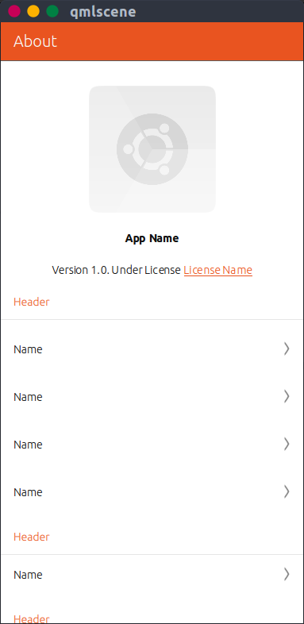

# About Template


Use:
- Copy `About.qml` and `ListItemHeader.qml` to the same folder
- Modify the top properties of About.qml
```
//Colors
property string frontColor: 	UbuntuColors.porcelain	// or "#000000" format
property string backColor:  	UbuntuColors.orange	// or "#000000"	format
property string detailsColor:  	UbuntuColors.slate	// or "#000000"	format
property string accentColor:  	UbuntuColors.orange	// or "#000000"	format

//Properties
property string iconAppRute: "icon.svg"
property string version: "1.0"
property string license: "<a href=' License Link '>License Name</a>"
```

- Edit section headers
`headerText: i18n.tr("Header")`

- Edit models information
```
devModel.append({ name: "Name", link: "https://link/" })
devModel.append({ name: "Name", link: "https://link/" })
```

- Delete non used Columns
```
Column {
	width: parent.width

	ListItemHeader{
		headerText: i18n.tr("Header")
	}

	Repeater {
		...
	}

	ListModel {
		id: poweredbyModel
		...
	}
}
```
